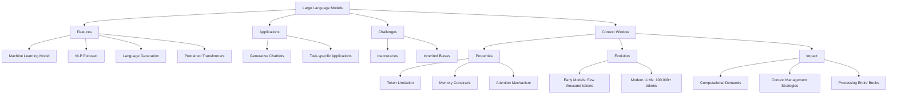
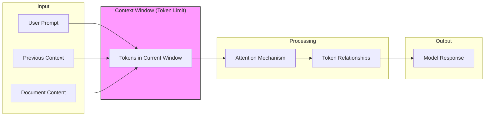
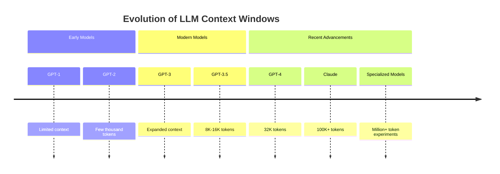
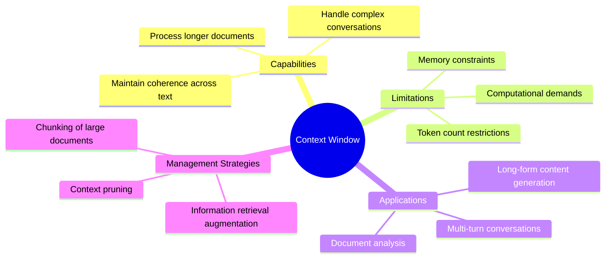

# Visual Diagram of Model Context Protocols

This document provides a visual representation of the concepts outlined in `mcp_knowledge.md`.

## LLM and Context Window Overview

## Context Window Functionality

## Context Window Size Evolution

## The Importance of Context Window

This visual representation illustrates the key concepts of Model Context Protocols, focusing on Large Language Models and their Context Windows as described in the original document.